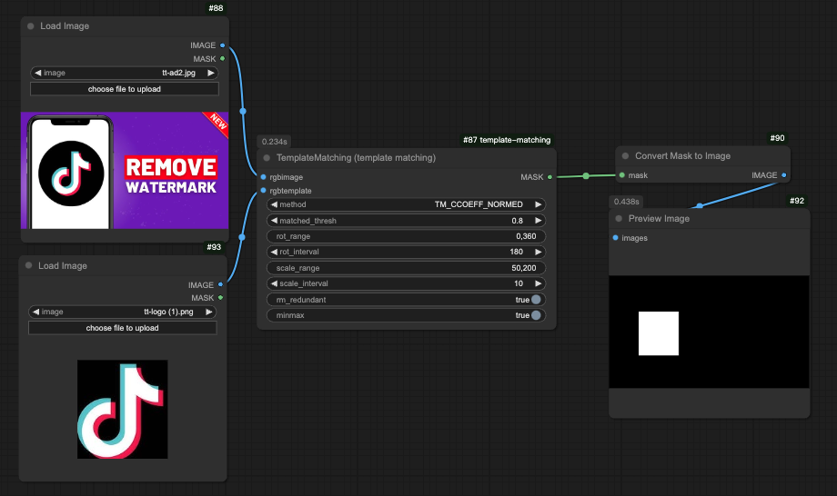

# ComfyUI template matching

This project is a ComfyUI version of  https://github.com/cozheyuanzhangde/Invariant-TemplateMatching. At the moment, it is a work in progress. Any help is appreciated and any feedback is welcome.



## Requirements

Please ensure that you have installed Python dependencies using the following command:
```
pip3 install -r requirements.txt
```

## Usage
```
rgbimage: RGB image where the search is running.
rgbtemplate: RGB searched template. It must be not greater than the source image and have the same data type.
method: [String] Parameter specifying the comparison method
matched_thresh: [Float] Setting threshold of matched results(0~1).
rot_range: [Integer] Array of range of rotation angle in degrees. Example: [0,360]
rot_interval: [Integer] Interval of traversing the range of rotation angle in degrees.
scale_range: [Integer] Array of range of scaling in percentage. Example: [50,200]
scale_interval: [Integer] Interval of traversing the range of scaling in percentage.
rm_redundant: [Boolean] Option for removing redundant matched results based on the width and height of the template.
minmax:[Boolean] Option for finding points with minimum/maximum value.
```